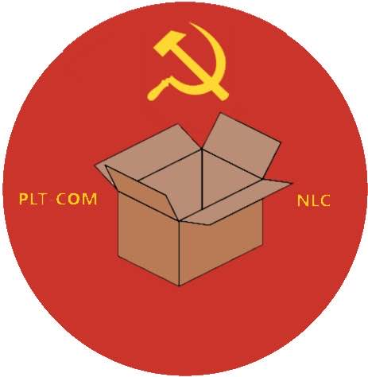

=  PLTCOM National Logistics Committee Documentation
:stylesdir: asciidoc/modules/docs/resources
:stylesheet: readthedocs.css
:imagesdir: asciidoc/modules/docs/resources/img
:toc: left

:data-uri:
== This is a test site generated with AsciiDoctor. To preview the site generated with MkDocs, click https://www.pltcom.org/mkdocs[here]
Welcome to the website for the People's Liberation and Training Committee! For the moment, this site hosts the documentation for the National Logistics Committee's (NLC) supply distribution platform hosted at https://odoo.pltcom.org. Soon, it will be a portal for all things PLTCOM.

== Position Duties and Requirements

Documents in this section outline the duties of various positions in the National Logistics Committee supply chain, and the requirements to fill those positions.

:leveloffset: +2

:includedir: asciidoc/modules/docs/modules

include::{includedir}/positions.adoc[]

:leveloffset: 0

==  Request Processing

Documents in this section outline the processes to receive donation and supply requests from the website and turn them into receipts and delivery requests.

:leveloffset: +2

:includedir: asciidoc/modules/docs/modules

include::{includedir}/request_processing.adoc[]

:leveloffset: 0

== Supply processing

Documents in this section outline the processes to handle deliveries and supplies requests from the inventory module, from the website through actually receiving or supplying materials.

:leveloffset: +2

:includedir: asciidoc/modules/docs/modules

include::{includedir}/supply_processing.adoc[]

